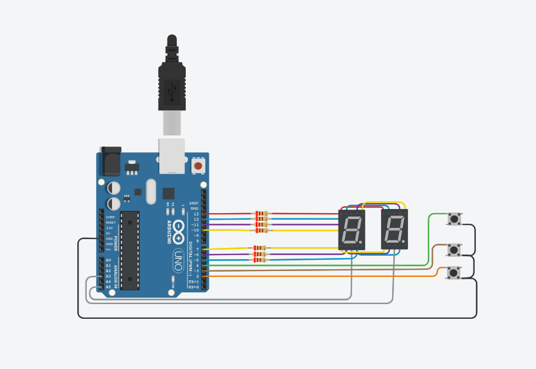

# Ejemplo Documentación 

## Integrantes 
- Connor Fornics	
- Gaton

## Proyecto: contador de 7 segmentos.

## Descripción
Esta es la parte 1 del proyecto: Contador con dos 7 segmentos, aplicando la multiplexacion.

## Función principal
Esta funcion se encarga de encender y apagar los segmentos que correspondan a UNIDAD y DECENA

A3 = UNIDAD Y A5 = DECENA, son #define que utilizamos para separar la salida de cada 7 segmentos, asociandolo a pines de la placa arduino.

(Breve explicación de la función)

~~~ C (C++)
void encenderDigitos(int digito)
{
  if(digito == UNIDAD)
  {
    digitalWrite(UNIDAD, LOW);
    digitalWrite(DECENA, HIGH);
    delay(Tiempo);
  }
  
  else 
    if(digito == DECENA)
  {
    digitalWrite(UNIDAD, HIGH);
    digitalWrite(DECENA, LOW);
    delay(Tiempo);
  }
  else
  {
    digitalWrite(UNIDAD, HIGH);
    digitalWrite(DECENA, HIGH);
  }
}
~~~

## :robot: Link al proyecto
- [proyecto](https://www.tinkercad.com/things/7XxyVYeLIpy-contador-dos7segmentos-tema-3-ejerc-3-connor-fornica/editel?sharecode=GiTqTAomAII716UoaGnZB-oRVvvOd4_Nc0Yr517HHNo)
## :tv: Link al video del proceso
- [video](https://www.youtube.com/watch?v=VyGjE8kx-O0)

---
### Fuentes
- [Consejos para documentar](https://www.sohamkamani.com/how-to-write-good-documentation/#architecture-documentation).

- [Lenguaje Markdown](https://markdown.es/sintaxis-markdown/#linkauto).

- [Markdown Cheatsheet](https://github.com/adam-p/markdown-here/wiki/Markdown-Cheatsheet).

- [Tutorial](https://www.youtube.com/watch?v=oxaH9CFpeEE).

- [Emojis](https://gist.github.com/rxaviers/7360908).

---
